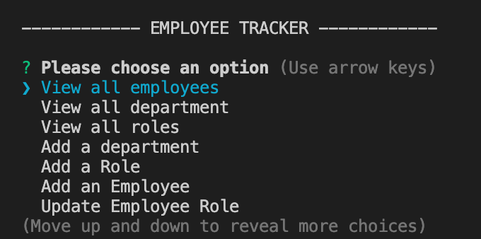

# employee-tracker

  

  

## Link:
 https://drive.google.com/file/d/1SDL_HQ4jH4eF8VQvUx0gRcrX7w-ZCXjn/view

  ## Description
  This project was to use inquirer and mysql to create an employee database. I used the inquirer prompt and db.query to create my functions. the functions hold the db.query and with the db.query i can then manipulate the sql database with the query response.

  ## Table of Contents
  * [Installation](#installation)
  * [Usage](#usage)
  * [License](#license)
  * [Contributing](#contributing)
  * [Questions](#questions)

  ## installation
  Must install inquirer by running npm install inquirer, install mysql to have access to the "db.query" and install console-table-printer to use printTable rather than console.logging the tables,

  
  ## License 
  This project is license under 

  ## Contributing
  This project was required to establish an sql connection. In order to contribute to this project, the user must enter their password after a mysql -u root -p.

  ## Tests
  node index 

  ## Questions
  If you have any questions about this repository, please contact me via kalaitzidispaul@gmail.com. You can view more of my projects at https://github.com/paulkalait
  